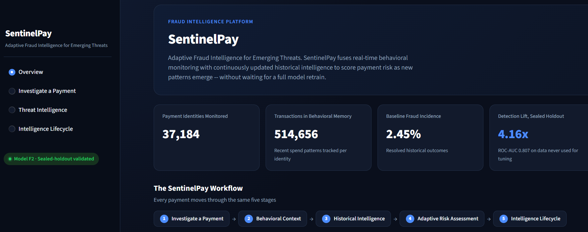
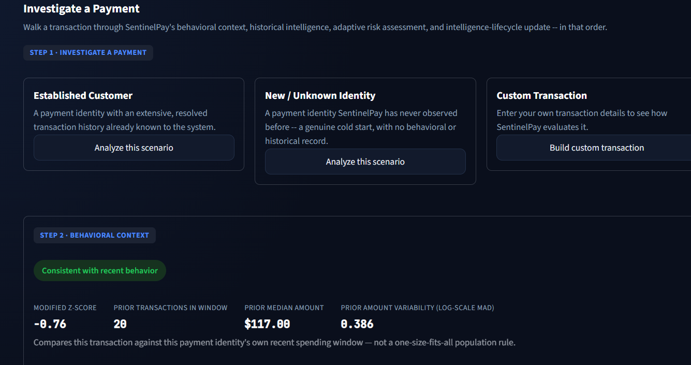
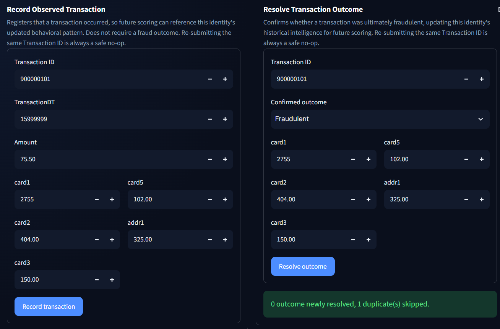
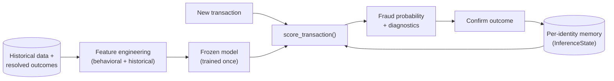

# SentinelPay

**Adaptive fraud intelligence: behavioral anomaly detection + continuously updated fraud history, fused through one frozen, auditable model.**

SentinelPay scores payment risk by combining two signals for a payment identity — how its current transaction compares to its own recent spending, and what its confirmed fraud history actually says — through a single validated machine-learning model. When a fraud outcome is confirmed, that history updates immediately, so the next transaction for the same identity is scored with better evidence. The model itself stays frozen; only the intelligence it's given grows.

## What It Does

- **Detects behavioral anomalies** per payment identity using a robust statistical baseline (median/MAD), not a population-wide rule.
- **Tracks confirmed fraud outcomes** per identity and smooths them into a reliable historical rate, even with little data.
- **Fuses both signals** through one validated logistic-regression classifier — no separate rules engine.
- **Updates its historical intelligence instantly** when an outcome is confirmed, without retraining the model.

## Key Result

Validated once, on a sealed holdout set the model never saw during training or feature selection:

| Metric | Value |
|---|---|
| ROC-AUC (sealed holdout) | **0.807** |
| PR-AUC (sealed holdout) | **0.218** |
| PR-AUC lift vs. transaction-only baseline | **4.16×** |
| Pre-declared validation gates passed | **4 / 4** |

*(Baseline: ROC-AUC 0.700 / PR-AUC 0.053 — transaction attributes only, no behavioral or historical signal. Source: `reports/eda/phase_h_results.json`.)*

## Application Demo

### Overview



### Payment Investigation



### Adaptive Fraud Intelligence Update



## How It Works

Every transaction moves through five stages on the "Investigate a Payment" page:

**Investigate Payment → Behavioral Context → Historical Intelligence → Adaptive Risk Assessment → Update Intelligence Lifecycle**

| Stage | What it answers |
|---|---|
| Investigate Payment | What are this transaction's details, and which payment identity does it belong to? |
| Behavioral Context | Does this amount look normal for *this identity's* recent spending? |
| Historical Intelligence | What does this identity's own confirmed-outcome track record say? |
| Adaptive Risk Assessment | The model's fused fraud probability, combining both signals. |
| Update Intelligence Lifecycle | Record this transaction and/or confirm its outcome — feeding every future score for this identity. |

## Architecture



The feedback loop on the right is the whole adaptive mechanism: confirming an outcome updates per-identity memory, which changes the *inputs* the frozen model sees next time — never the model itself.

## Key Technical Ideas

- **Behavioral baseline** — for each payment identity, the median and MAD (median absolute deviation) of its last 20 transaction amounts, robust to a handful of prior outliers. A new amount becomes a *modified z-score*; `|z| ≥ 3.5` flags a behavioral anomaly (Iglewicz & Hoaglin, 1993).
- **Smoothed confirmed-fraud history** — an identity's raw fraud rate is unreliable with little data, so it's blended toward the population-wide rate: `smoothed_rate = (fraud_count + k·global_rate) / (event_count + k)`, `k=20`. A brand-new identity gets the population baseline; an established one gets a rate dominated by its own record.
- **Frozen model, live state** — the classifier (`StandardScaler` + `LogisticRegression`) is fit once on training data and never refit. `score_transaction` is a pure function: it reads state, never writes it.
- **Intelligence update ≠ model retraining** — resolving a transaction updates counters that become *input features* for future scores. It does not touch the model's learned coefficients, and there is no online learning anywhere in the system.

## Dataset

Built on **IEEE-CIS Fraud Detection** ([Kaggle](https://www.kaggle.com/competitions/ieee-fraud-detection/data), Vesta Corporation) — 590,540 transaction rows with mostly anonymized fields. The dataset publishes no real customer/card ID, so SentinelPay constructs a `payment_proxy_key` from `card1/card2/card3/card5/addr1` — **a research grouping heuristic, not a confirmed real-world identity.**

Raw Kaggle CSVs are **not included** in this repository. They're only needed to reproduce the EDA/training pipeline — the dashboard runs out of the box using the pre-built model and state already committed under `artifacts/inference/`.

## Validation

The dataset is split chronologically into five partitions (`train` / `embargo_1` / `validation` / `embargo_2` / `holdout`). The holdout set was sealed before any model, feature, or threshold decision was made, and evaluated exactly once against a fixed, pre-declared feature ladder — comparing the full adaptive model against a transaction-attributes-only baseline. All four pre-declared gates (relative PR-AUC lift, ROC-AUC parity, bootstrap CI above zero, historical-intelligence-alone beats baseline) passed; see [Key Result](#key-result).

## Quick Start

Requires Python 3.11.

```bash
python -m venv .venv
.venv\Scripts\activate        # Windows
source .venv/bin/activate     # macOS/Linux

pip install -r requirements.txt
pip install -e .

streamlit run app.py          # launch the dashboard
pytest                        # 327 tests currently pass
```

No dataset download needed — the model and inference state are already committed to this repo. The dashboard runs its own isolated sandbox copy of that state, so record/resolve actions never touch the production snapshot (resettable from the Intelligence Lifecycle page).

**Scoring outside the dashboard** (`sentinelpay.inference.cli`):

```bash
python -m sentinelpay.inference.cli score --input txn.json            # score a transaction
python -m sentinelpay.inference.cli record-observed --input txn.json  # grow behavioral memory
python -m sentinelpay.inference.cli update-resolved --input txn.json  # confirm an outcome
```

Both `record-observed` and `update-resolved` are idempotent, keyed by `TransactionID` — replaying the same transaction is always a safe no-op.

## Demo Flow

**Normal transaction → behavioral anomaly → confirmed fraud → intelligence update → follow-up transaction**

1. A payment identity with clean, established history scores low.
2. A transaction whose amount sharply deviates from that identity's normal pattern is flagged as a behavioral outlier.
3. That transaction is resolved as **Fraudulent** through Update Intelligence Lifecycle — updating this identity's record, not the model.
4. Its historical fraud rate moves immediately.
5. A later transaction for the *same* identity is scored again — same behavioral logic, but now informed by the just-confirmed outcome.

## Project Structure

```
SentinelPay/
├── app.py                  # Streamlit dashboard
├── ui_state.py              # Sandbox-state helpers
├── configs/                 # Detection thresholds, dataset paths, chronological split
├── src/sentinelpay/
│   ├── detection.py          # Behavioral anomaly scoring
│   ├── target_history.py     # Smoothed historical fraud-rate
│   ├── model_features.py     # Feature assembly for the classifier
│   ├── eda/                  # Research & validation pipeline
│   └── inference/            # Frozen model, live state, scoring, CLI
├── artifacts/inference/      # Committed model + inference-state snapshot
├── reports/eda/              # Deterministic validation reports & results
└── tests/                    # 327 tests across 27 modules
```

## Limitations & Responsible Use

- `payment_proxy_key` is a heuristic grouping over anonymized fields — never present it as a confirmed real-world customer or card.
- Validated once on a sealed holdout split of one historical dataset; this is not a claim about live-traffic performance.
- "Resolved" means the moment an outcome is confirmed in the system, not a true real-world confirmation timestamp.
- This is a research/hackathon prototype over a public benchmark dataset, not a production fraud system.
- A separate coordinated-abuse/fraud-ring investigation was explored and found inconclusive — it is **not** part of the production risk score.

## Takeaway

Confirmed fraud shouldn't sit locked in historical data, waiting for the next retraining cycle to matter. SentinelPay keeps its model fixed and auditable, but lets the evidence behind every score — one payment identity's behavior and history — keep growing the moment new outcomes are confirmed.
