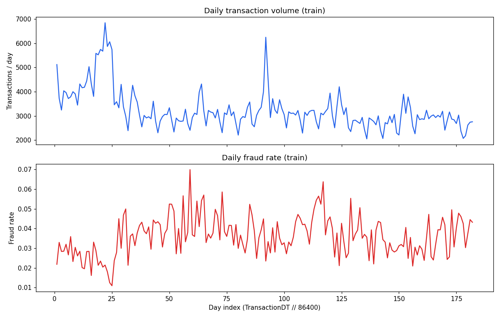

# SentinelPay -- Phase A EDA & Data Validation Report

Dataset: IEEE-CIS Fraud Detection (Vesta), raw files in `data/raw/`. **Generated deterministically by `sentinelpay.eda.generate_report.render_report` from `reports/eda/phase_a_results.json`** -- every number below is read from that file, not hand-typed; re-running `python -m sentinelpay.eda.run_phase_a` regenerates both together so they cannot diverge.

## 1. Field semantics: documented vs. proxy vs. unknown

This project does not rename anonymized columns. This section exists so
later phases can reason about *why* a column might behave a certain way
without asserting it means something Vesta never confirmed.

**Officially documented** (Kaggle competition data page / host statements):

| Field(s) | Documented meaning |
|---|---|
| `TransactionDT` | Timedelta in **seconds** from an undisclosed reference datetime -- not a real timestamp. Confirmed: min value is exactly 86400 = 24h. |
| `TransactionAmt` | Transaction amount, USD. |
| `C1-C14` | "Counting" features (host's word), e.g. number of addresses associated with the card. Exact definitions withheld. |
| `D1-D15` | "Timedelta" features, e.g. days since previous transaction. Exact reference points per column withheld. |
| `V1-V339` | Vesta-engineered features: ranking, counting, and "other entity relations." No per-column definitions published. |
| `id_01-id_11` | Numeric identity signals from Vesta/security partners (device rating, IP-domain rating, proxy rating, behavioral fingerprints). Exact scoring undisclosed. |
| `ProductCD`, `card1-card6`, `addr1-addr2`, `dist1-dist2`, `P_/R_emaildomain`, `M1-M9` | Named/self-descriptive transaction and card attributes. |
| `DeviceType`, `DeviceInfo`, and the categorical block of `id_12-id_38` | Device/network/browser signals collected at transaction time. |

**Reasonable proxy interpretations** (widely reproduced in public analyses,
*not* Vesta-confirmed -- treat as hypotheses, not fact):
- `id_30` values look like OS strings (`"Android 7.0"`, `"Windows 10"`).
- `id_31` values look like browser strings (`"samsung browser 6.2"`).
- `id_33` values look like screen resolutions (`"2220x1080"`).
- card1/card2/card3/card5 + addr1 is used in this project as a
  `payment_proxy_key` -- there is no published card/customer ID.

**Corrected during Phase A** (a generic web summary claimed the entire
`id_12-id_38` block is categorical -- false on direct inspection): `id_14`
(numeric, looks like a timezone offset in minutes), `id_17`, `id_19`,
`id_20`, `id_32` are numeric in the actual data. The loader does not
hardcode a categorical list for the identity file for this reason.

**Unknown / do not claim**: which specific real-world quantity each `V`
column encodes; the exact reference point for each `D` column; what
`C1..C14` count individually.

Sources: [Kaggle competition data page](https://www.kaggle.com/competitions/ieee-fraud-detection/data), [host discussion #101203](https://www.kaggle.com/c/ieee-fraud-detection/discussion/101203), [IEEE DataPort mirror](https://ieee-dataport.org/documents/ieee-cis-fraud-detection).

## 2. Schema validation (train vs. test)

- `train_transaction`: 394 columns | `test_transaction`: 393 columns. `isFraud` absent from test transaction schema: **True**. Consistent ignoring `isFraud`: **True**.
- `train_identity`: 41 columns | `test_identity`: 41 columns. Consistent after `id-XX`->`id_XX` normalization: **True**.

## 3. TransactionID <-> Identity join validation

| | train | test |
|---|---|---|
| transaction rows | 590,540 | 506,691 |
| identity rows | 144,233 | 141,907 |
| duplicate TransactionIDs | 0 | 0 |
| identity orphans (no matching transaction) | 0 | 0 |
| % transactions with identity | 24.42% | 28.01% |
| join clean | True | True |

## 4. `id-XX` -> `id_XX` normalization

Confirmed: `train_identity.csv` ships `id_01..id_38`, `test_identity.csv` ships `id-01..id-38`. Normalized in memory only, immediately after `pd.read_csv`, by `sentinelpay.data.loader.normalize_identity_columns` -- `data/raw/*.csv` is never opened in write mode by any project code (see `tests/test_loader.py` for the no-source-mutation test).

## 5. Duplicates & missingness

- **0** fully duplicated rows in `train_transaction`.
- **44.16%** of columns are >50% missing.

Top 20 most-missing columns:

| column | n_missing | pct_missing |
|---|---|---|
| dist2 | 552913 | 93.6284 |
| D7 | 551623 | 93.4099 |
| D13 | 528588 | 89.5093 |
| D14 | 528353 | 89.4695 |
| D12 | 525823 | 89.0410 |
| D6 | 517353 | 87.6068 |
| D9 | 515614 | 87.3123 |
| D8 | 515614 | 87.3123 |
| V153 | 508595 | 86.1237 |
| V139 | 508595 | 86.1237 |
| V162 | 508595 | 86.1237 |
| V161 | 508595 | 86.1237 |
| V154 | 508595 | 86.1237 |
| V138 | 508595 | 86.1237 |
| V158 | 508595 | 86.1237 |
| V157 | 508595 | 86.1237 |
| V163 | 508595 | 86.1237 |
| V156 | 508595 | 86.1237 |
| V155 | 508595 | 86.1237 |
| V149 | 508595 | 86.1237 |

## 6. Temporal structure

- Day index range: 1-182 (182 distinct days).
- Daily volume: min 2,048, max 6,852, mean 3245 transactions/day.
- Daily fraud rate: 1.10% - 6.99%.
- Overall fraud rate: 3.499%.

## 7. Distribution drift (early vs. late half, split at day 91)

**Numeric (KS 2-sample), curated columns, top drift:**

| column | ks_statistic | p_value | mean_early | mean_late | pct_missing_early | pct_missing_late |
|---|---|---|---|---|---|---|
| C9 | 0.1565 | 0.0000 | 4.0679 | 4.9546 | 0.0000 | 0.0000 |
| C8 | 0.0980 | 0.0000 | 8.5706 | 1.2031 | 0.0000 | 0.0000 |
| D15 | 0.0978 | 0.0000 | 151.7834 | 176.2227 | 18.9632 | 10.6342 |
| C10 | 0.0977 | 0.0000 | 8.7583 | 1.1931 | 0.0000 | 0.0000 |
| D6 | 0.0856 | 0.0000 | 60.6764 | 81.2481 | 87.1147 | 88.1728 |
| C4 | 0.0838 | 0.0000 | 6.3751 | 1.4658 | 0.0000 | 0.0000 |
| D13 | 0.0783 | 0.0000 | 16.4155 | 19.5475 | 89.6929 | 89.2980 |
| C12 | 0.0775 | 0.0000 | 7.1152 | 0.5801 | 0.0000 | 0.0000 |
| D1 | 0.0767 | 0.0000 | 85.9157 | 104.0927 | 0.0013 | 0.4606 |
| D4 | 0.0724 | 0.0000 | 130.9203 | 149.2862 | 32.5401 | 24.0772 |

**Categorical (chi-square, period x category):**

| column | chi2_statistic | p_value | n_categories_observed |
|---|---|---|---|
| M3 | 63334.2979 | 0.0000 | 3 |
| M1 | 63309.1419 | 0.0000 | 3 |
| M2 | 63308.5994 | 0.0000 | 3 |
| ProductCD | 15539.0287 | 0.0000 | 5 |
| M6 | 7764.0960 | 0.0000 | 3 |
| card6 | 2997.3455 | 0.0000 | 5 |
| M5 | 1819.9361 | 0.0000 | 3 |
| M4 | 1774.0432 | 0.0000 | 4 |
| card4 | 1444.4051 | 0.0000 | 5 |
| P_emaildomain | 778.2751 | 0.0000 | 60 |

**V-column sample (low-missingness subset), top drift:**

| column | ks_statistic | p_value | mean_early | mean_late | pct_missing_early | pct_missing_late |
|---|---|---|---|---|---|---|
| V12 | 0.1008 | 0.0000 | 0.5087 | 0.6121 | 17.5442 | 7.5182 |
| V13 | 0.1004 | 0.0000 | 0.5474 | 0.6523 | 17.5442 | 7.5182 |
| V4 | 0.0223 | 0.0000 | 0.8273 | 0.8585 | 62.0472 | 30.3201 |
| V5 | 0.0210 | 0.0000 | 0.8585 | 0.8886 | 62.0472 | 30.3201 |
| V15 | 0.0203 | 0.0000 | 0.1329 | 0.1115 | 17.5442 | 7.5182 |
| V16 | 0.0202 | 0.0000 | 0.1348 | 0.1119 | 17.5442 | 7.5182 |
| V3 | 0.0172 | 0.0000 | 1.0643 | 1.0867 | 62.0472 | 30.3201 |
| V7 | 0.0139 | 0.0000 | 1.0621 | 1.0796 | 62.0472 | 30.3201 |
| V2 | 0.0129 | 0.0000 | 1.0353 | 1.0514 | 62.0472 | 30.3201 |
| V18 | 0.0121 | 0.0000 | 0.1424 | 0.1282 | 17.5442 | 7.5182 |

## 8. Leakage audit (correlation_mode = `curated`)

- TransactionID vs. TransactionDT rank Spearman correlation: **1.0000** (file sorted by DT: True, sorted by ID: True). A value of 1.0 means TransactionID must never be used as a feature -- it leaks time order.

**Curated (non-V) target correlation, top 15 (via `corrwith`, O(k*n)):**

| column | abs_corr_with_target | corr_with_target |
|---|---|---|
| D8 | 0.1426 | -0.1426 |
| D7 | 0.1272 | -0.1272 |
| D2 | 0.0836 | -0.0836 |
| D15 | 0.0775 | -0.0775 |
| D10 | 0.0720 | -0.0720 |
| D4 | 0.0672 | -0.0672 |
| D1 | 0.0672 | -0.0672 |
| D5 | 0.0646 | -0.0646 |
| D13 | 0.0594 | -0.0594 |
| D6 | 0.0572 | -0.0572 |
| D3 | 0.0463 | -0.0463 |
| D11 | 0.0451 | -0.0451 |
| D9 | 0.0443 | -0.0443 |
| C2 | 0.0372 | 0.0372 |
| C8 | 0.0321 | 0.0321 |

**V-column blocks by shared missingness signature, top 10 by max |corr| in block:**

| pct_missing | n_columns | max_abs_corr | mean_abs_corr | top_column |
|---|---|---|---|---|
| 77.9134 | 46 | 0.3831 | 0.0912 | V257 |
| 76.3235 | 19 | 0.3280 | 0.1404 | V201 |
| 28.6126 | 18 | 0.2818 | 0.1684 | V45 |
| 86.1237 | 18 | 0.2781 | 0.1694 | V158 |
| 15.0987 | 20 | 0.2518 | 0.1349 | V86 |
| 76.3554 | 31 | 0.2310 | 0.0391 | V199 |
| 13.0552 | 22 | 0.1859 | 0.1031 | V74 |
| 12.8819 | 23 | 0.1835 | 0.1050 | V33 |
| 76.0531 | 16 | 0.1664 | 0.0739 | V222 |
| 0.0532 | 43 | 0.1382 | 0.0345 | V123 |

- Near-duplicate rows on ['card1', 'card2', 'addr1', 'TransactionAmt', 'TransactionDT']: 63 (0.0107%) of 590,540 rows.

## 9. Candidate proxy-key relationships (exploratory evidence only)

**`payment_proxy_key`** (card1, card2, card3, card5, addr1): 514,655 rows valid, 38,145 groups, 15,038 singletons, largest group 5,866 rows.
Fraud rate: shared-key rows **2.43%** vs. singleton rows **3.17%** (overall 2.45%). Lower for shared groups than singletons -- naive shared-key intuition does not hold on this proxy.

Fraud rate by group-size bucket:

| group_size_bucket | n_rows | fraud_rate |
|---|---|---|
| 1 | 15038 | 0.0317 |
| 2 | 11304 | 0.0293 |
| 3-5 | 24345 | 0.0285 |
| 6-10 | 30665 | 0.0245 |
| 11-25 | 59445 | 0.0246 |
| 26-100 | 118511 | 0.0253 |
| 100+ | 255347 | 0.0230 |

**`device_proxy_key`** (DeviceInfo, id_31, identity-linked subset): 118,367 rows valid, 5,320 groups, 2,283 singletons, largest group 16,406 rows (a group this large is almost certainly a generic/popular device+browser signature shared by many unrelated users, not a coordinated actor).
Fraud rate: shared-key rows **7.35%** vs. singleton rows **2.72%** (overall 7.26%).

Fraud rate by group-size bucket:

| group_size_bucket | n_rows | fraud_rate |
|---|---|---|
| 1 | 2283 | 0.0272 |
| 2 | 1640 | 0.0476 |
| 3-5 | 3819 | 0.1139 |
| 6-10 | 4170 | 0.1345 |
| 11-25 | 6164 | 0.1475 |
| 26-100 | 9181 | 0.1656 |
| 100+ | 91110 | 0.0553 |

## Proxy-key terminology and EDA/target-encoding rule

Section 9 below uses `payment_proxy_key` (card1/card2/card3/card5/addr1) and
`device_proxy_key` (DeviceInfo/id_31). These are candidate groupings, not
confirmed real-world entities -- there is no published customer or device
ID in this dataset. This is exploratory evidence gathering for later
phases, not the Phase E coordinated-ring detection system.

**Rule enforced from this phase forward**: any target-derived statistic
computed during EDA (fraud rate by proxy-key group, target correlation,
etc.) is EDA evidence only and must never become a modeling feature
directly. A future target encoding or historical-fraud-rate feature must be
computed using only information available strictly before the transaction
being scored (chronological, fold-safe logic), not the whole-dataset
aggregates this report shows. No target encoding is implemented in Phase
A/B.

## 10. Memory observations

| baseline_process_rss_mb | train_transaction_full_df_mb | after_full_load_process_rss_mb | after_correlation_process_rss_mb | final_process_rss_mb |
|---|---|---|---|---|
| 152.8200 | 861.1200 | 5867.9800 | 1771.0200 | 2703.7500 |

`load_transaction_full` was called explicitly, once, for this comprehensive scan (whole-file missingness/duplicate checks need every column). Routine/ad-hoc analyses should prefer `load_transaction_columns` or `load_transaction_sample` instead. Correlation analysis uses `corrwith` (O(k*n)) rather than a full `.corr()` matrix (O(k^2*n)), which was the actual cause of the previously observed ~5.4GB/2.5min cost -- V-columns are handled as missingness-grouped blocks, not blindly included.

## Proposed next-phase feature groups (naming only -- not implemented)

1. **Transaction-intrinsic** (documented): `TransactionAmt`, `ProductCD`, card attributes, address, email domain, `dist1/dist2`.
2. **Counting features** (documented category, undocumented specifics): `C1-C14`.
3. **Timedelta features** (documented category, undocumented specifics): `D1-D15`.
4. **Match flags** (documented as match indicators): `M1-M9`.
5. **Vesta engineered** (opaque): `V1-V339`, grouped by missingness-block (see leakage section) rather than by assumed semantics.
6. **Identity -- numeric scores** (documented category): `id_01-id_11`.
7. **Identity -- device/network** (mixed categorical/numeric): `id_12-id_38`, `DeviceType`, `DeviceInfo`.

## Proposed spike/behavioral-change-detection approaches (Phase D -- not implemented)

Treated as a temporal behavioral-change problem first, per instruction:
rolling robust statistics (median/MAD), EWMA, CUSUM/change-point detection
as primary candidates; Isolation Forest proposed only as a complementary
transaction-level outlier detector, not the primary method. No algorithm is
selected yet.

## Proposed ring-detection approaches (Phase E -- not implemented)

Neither proxy key tried in this report is usable alone (see section 9) --
`payment_proxy_key` sharing is not predictive in the naive direction, and
`device_proxy_key` sharing is predictive but polluted by generic/popular
fingerprints. Next step is a `composite_proxy_key` (combining keys) and/or
inverse-frequency weighting before a graph-based ring signal is attempted.
